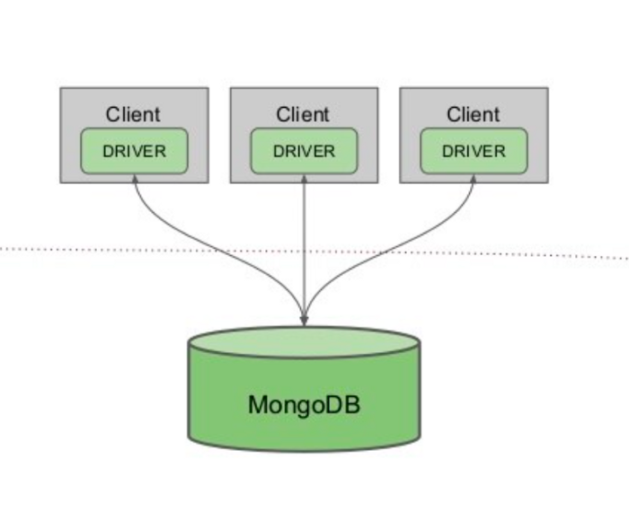
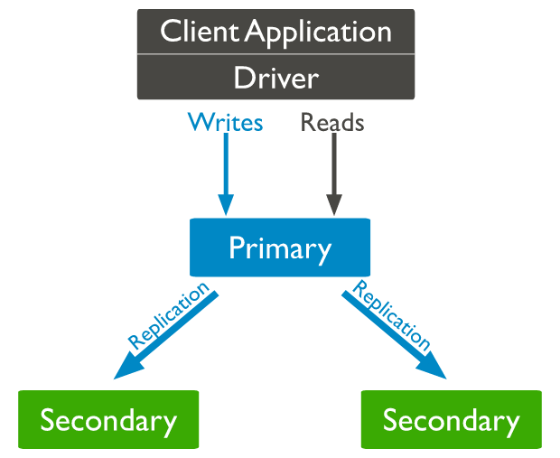
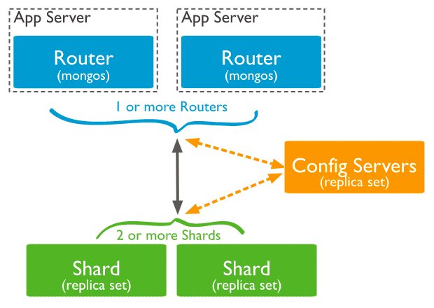

##MongoDB introduction

1. What is MongoDB?

    - MongoDB is a NoSQL and document database. It stores data in a type of Json called Bson
    - A record of MongoDB is a document that is a data structure composed of key-value pairs similar to the structure of JSON objects
    - A group of documents is Collection. It is like table of relational database
    - MongoDB uses Btree for data structure
    - A simple document structure
         ```json
         {
           "_id": "1a56d6s67s9d8ss",
           "name": "MongoDB",
           "type_supports": [
                   "int",
                   "array",
                   "int"
           ]   
         }
         ``` 
    - We can install MongoDB in bare metal or use MongoDB cloud
    - MongoDB supports standalone and cluster (sharding, replicas)
    - MongoDB also has a lot of tools support for administration like mongod, mongosh, mongo, monodump,...
    - MongoDB supports multiple languages: Java, Golang, Python, C, C++...
2. Future of MongoDB
    - Document oriented: MongoDB stores the main subject in the minimum of documents and not breaking it up into multiple pieces like RDBMS.
    - Scalable: MongoDB supports Shading (partition data into multiple servers). So, It can scale horizontal easily
    - Indexing: If a collection does not index, it will scan all documents to select documents these match the query. It is inefficient. With indexing, we can reduce resources, time, and cost for queries in huge volumes of data.
    - Replication and High availability: MongoDB provides a replica set which is a group of MongoDB instances. All instances maintain the same data in a replica set. Replica sets provider redundancy and high availability. If one instance goes down, the data can be retrieved from other active instances.
    - Aggregation: MongoDb also supports aggregation like group by in RDBMS. Some basic aggregation like sum, max, min, avg...
3. MongoDB architecture
    - Standalone
      
    - Replicas
      
    - Sharding
      
