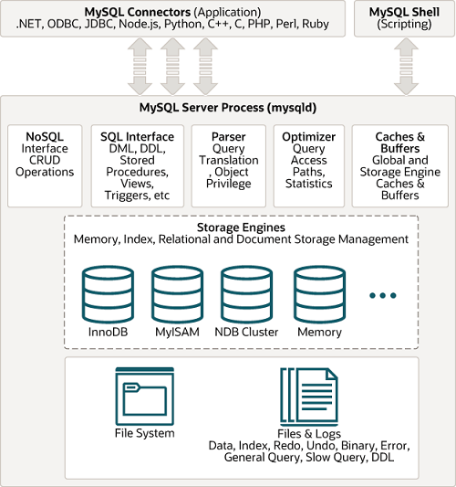

###MySQL

1. Introduction
   - It's a RDBMS database
   - It uses SQL to query
   - It is a fast
   - Developed by Oracle
2. Architecture

    

3. Advantage
   - Open source and free
   - Support multiple languages like PHP, Java, C/C++, Perl,...
   - Support Foreign key and Primary key
   - The row number in a table up to 50 million rows and 8 Tb each table
   - Support transaction, commit, rollback
4. Disadvantage
   - From Mysql older than 5.0, It doesn't support Commit, Role, Stored produce
   - It doesn't run efficiently on large data
   - It doesn't support SQL check constraints
5. When we use it
   - Using for small and big businesses